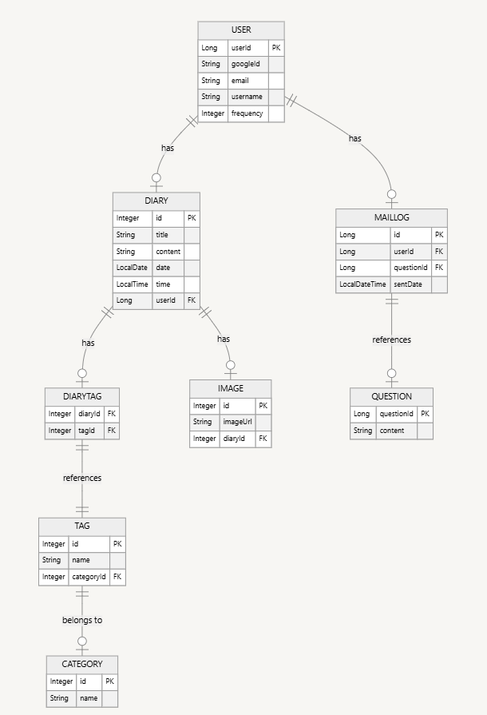

# Haru-Mail-Backend

## 사용기술
 

 

## 개발 환경
- **백엔드**: Java 21, Spring Boot 3.4.2
- **데이터베이스**: MySQL, Redis
- **빌드 도구**: Gradle
- **개발 도구**: IntelliJ IDEA Community Edition 2023.3.2
- **버전 관리**: Git, GitHub
- **협업 도구** : Google Docs  
  
## 데이터베이스 관계도

### 테이블 구조

**USER**
- 사용자 정보
- 사용자와 관련된 다이어리, 메일 로그가 연결

**DIARY**
- 다이어리 정보
- 사용자와 1:N 관계를 가짐

**CATEGORY**
- 카테고리 정보
- 태그가 속하는 카테고리와 1:N 관계를 가짐

**TAG**
- 태그 정보
- 각각의 태그는 특정 카테고리에 속함

**DIARYTAG**
- 다이어리와 태그의 다대다 관계 정보
- 하나의 다이어리는 여러 태그를 가질 수 있고, 하나의 태그는 여러 다이어리에 포함될 수 있음

**IMAGE**
- 다이어리에 첨부된 이미지
- 다이어리와 1:N 관계를 가짐

**MAILLOG**
- 메일 전송 로그
- 사용자가 어떤 질문을 받았는지 기록하며, 사용자와 질문은 각각 외래키로 연결

**QUESTION**
- 질문 정보
- 메일 로그와 1:N 관계를 가짐

## 아키텍처 구조
이 프로젝트는 AWS EC2 인스턴스에서 실행되며, 아래와 같은 주요 구성 요소로 이루어짐 

**주요 구성 요소**  
| 구성 요소                          | 설명                                            |
| ------------------------------ | --------------------------------------------- |
| **Spring Boot**                | 핵심 백엔드 로직 (REST API, JWT 인증, 2FA, DB 연동 등 처리) |
| **Caddy**                      | 리버스 프록시, HTTPS 인증 자동화, 포트 포워딩 등 처리            |
| **Redis**                      | 인증 토큰 저장 (예: 블랙리스트 처리), 세션 캐싱 등               |
| **MySQL**                      | 사용자, 다이어리, 태그, 카테고리 등 주요 엔티티 저장               |
| **Cloudinary**                 | 이미지 파일 저장 및 CDN 제공                            |
| **JWT + Google Authenticator** | 사용자 인증, 2차 인증 보안 강화                           |
| **AWS EC2**                    | 전체 시스템 호스팅 및 서비스 실행                           |

**구조도**  

**서버 아키텍처 흐름**  
1. 사용자가 JWT 토큰을 포함하여 다이어리 작성 요청
2. Caddy → Spring Boot API 전달
3. JWT 인증 및 2FA 확인
4. 다이어리 + 태그 + 이미지 정보 처리
5. 이미지 → Cloudinary 업로드
6. 다이어리, 태그 → MySQL 저장
7. 응답 반환
